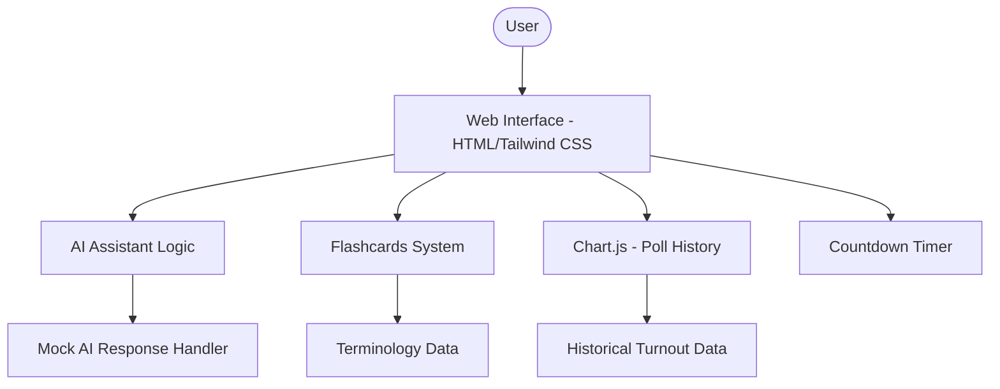
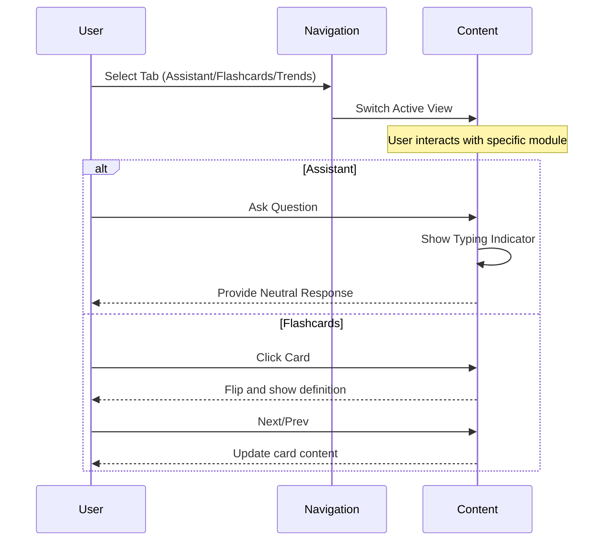

# Civicly - Interactive Election Assistant

Civicly is a modern, interactive web application designed to help users understand election processes, timelines, and terminology in an easy-to-follow way. It provides a comprehensive set of tools, including an AI-powered assistant, educational flashcards, and historical polling data visualizations.

## Key Features

- **AI Assistant**: A conversational interface that provides neutral, factual information about electoral processes, registration, and more.
- **Interactive Flashcards**: A study deck for mastering key election terms like "Electoral College," "Gerrymandering," and "PACs."
- **Poll History Visualization**: Real-time charts showing historical voter turnout trends to provide context for current elections.
- **Election Countdown**: A prominent timer tracking the time remaining until the next general election.
- **Modern UI/UX**: A responsive, tabbed interface built with a clean light-mode aesthetic and smooth animations.

## Technical Architecture

The project is built as a highly performant static web application using a modern tech stack.



## Application Flow



## Deployment

The project is containerized using Docker and is ready for deployment to cloud platforms like Google Cloud Run.

### Local Development
To run the project locally, simply open `index.html` in any modern web browser.

### Cloud Deployment
A `Dockerfile` is provided for containerizing the application using NGINX.

```bash
docker build -t civicly .
docker run -p 8080:8080 civicly
```

## Technologies Used

- **Frontend**: HTML5, Vanilla JavaScript, Tailwind CSS
- **Icons**: FontAwesome 6
- **Data Visualization**: Chart.js
- **Containerization**: Docker (NGINX)
- **Deployment Target**: Google Cloud Run
